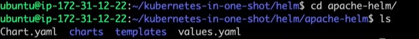
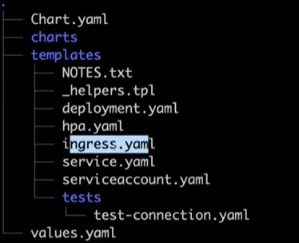
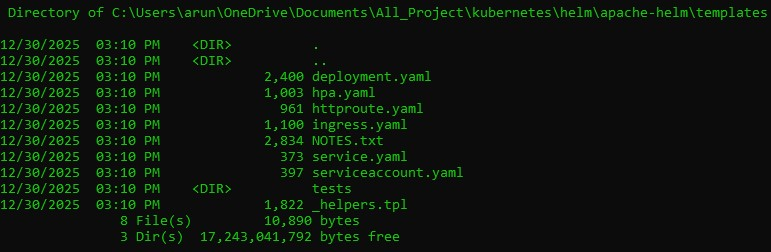
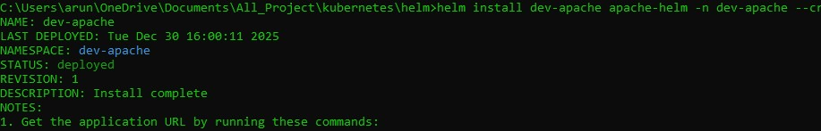

#### Helm helps manage Kubernetes applications efficiently by packaging manifests into reusable charts. It provides templating, supports environment-specific configurations, enables easy upgrades and rollbacks, and simplifies CI/CD automation. Overall, Helm reduces operational complexity and improves deployment consistency.

Suppose I need to deploy three applications like nginx, mysql, and my-app in Kubernetes.

For each application, I have to create multiple YAML files such as Deployment, Service, HPA, ConfigMap, and Secrets.

Managing and maintaining these YAML files separately for every application and environment becomes complex and error-prone.

#### Helm was introduced to solve this problem.
Helm packages all these Kubernetes resources into a single Helm chart using templates and values files.

```
                    HELM
                     |
    nginx           mysql              my-app
_____|_______________|___________________|___________
|Deployment.yml  |Deployment.yml    |Deployment.yml |
|service.yml     |service.yml       |service.yml    |
|ingress.yml     |ingress.yml       |ingress.yml    |
|config_map.yml  |config_map.yml    |config_map.yml |
|hpa.yml         |hpa.yml           |hpa.yml        |
|secret.yml      |secret.yml        |secret.yml     |
_____________________________________________________
```

## Steps to Install Helm
1. LINUX:
To install helm we have to download file and run that file
```
curl -fsSL -o get_helm.sh https://raw.githubusercontent.com/helm/helm/main/scripts/get-helm-4
```

Provide executeable permission:
```
chmod +x get_helm.sh
```

Execute the sh file
```
./get_helm.sh
```

2. WINDOWS:
Open Powershell as Adminstrator
```
choco install kubernetes-helm -y
```
Software installed to 
```
C:\ProgramData\chocolatey\lib\kubernetes-helm\tools
```

## Create Template using helm
```
helm create apache-helm
```
```
cd apache-helm
```
Observed 4 files created
chart.yaml, charts, templates, values.yaml





### 1. Service.yaml

Open Service.yaml file and update
```
targetPort: {{ .Values.service.targetPort }}
```

### 2. Values.yaml

In Helm, we define configurable values in ```values.yaml```, and these values are automatically injected into Kubernetes resource templates such as ```service.yaml```.

like below update the values in value.yaml
```
image:
  repository: httpd
  pullPolicy: IfNotPresent
  tag: "2.4"
targetPort: 80
```

### 3. Chart.yaml
In Helm, Chart.yaml defines the metadata of the Helm chart, such as the chart name, version, and application version. Helm uses this information to identify, version, and manage the chart during installation, upgrade, and rollback operations.


### After update the yaml file
Run
```
helm package .
```
It will generate
```apache-helm-0.1.0.tgz```


creates a Helm release named ```dev-apache```, and deploys all Kubernetes resources into a namespace called ```dev-apache```, creating the namespace automatically if it does not already exist.
Run:
```
helm install dev-apache apache-helm -n dev-apache --create-namespace
```



Common cmd to verify dev apche is running or not:
```
kubectl get pods -n dev-apache
```
```
kubectl get deployment -n dev-apache
```

```
kubectl get service -n dev-apache
```
Then we have to expose the service to Public

```
kubectl port-forward svc/dev-apache-apache-helm 80:80 -n dev-apache --address=0.0.0.0
```
To Roll back to previous deployment.
```
helm rollback dev-apache 1 -n dev-apache
```
To Delete the apache-helm package
Run:
```
helm uninstall dev-apache -n dev-apache
```
## Artrifcat hub URL
```
https://artifacthub.io/packages/search
```

### Added list
```
helm repo list
```
```
helm list -n <namespace>
```